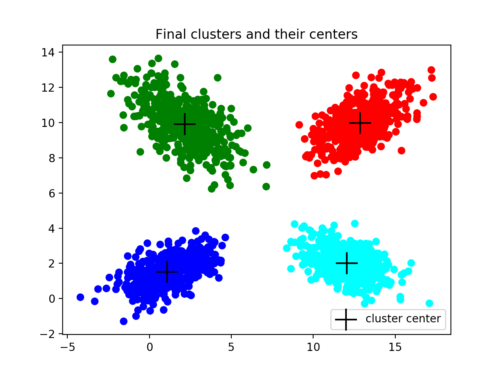

# Pattern Recognition

Pattern Recognition methods, including:

- Bayes, Linear, Quadratic Classifier
- Sequential Tests
- Clustering (Kmeans and Square Error)

Additionally, not-MNIST model for Serbian Vowels is implemented.

## What can these methods do?

Some of the classification results are shown below. Various classifiers are implemented, including Linear, Bayes and Quadratic.

|  | |
|:---:|:---:|
| Bayes Classifier | Quadratic Classifier |

Wald sequential test is capable of classifying examples, even if the classes are totally non-separable, as shown below. 

|  | |
|:---:|:---:|
| PDFs for two classes | Wald classification illustrated |

The result of Kmeans clustering method is shown below. Additionally, you can find and plot stats for the number of steps the method in average needs to converge.

|  | |
|:---:|:---:|
| Kmeans result | Stats for Kmeans |

## What is not-MNIST for Serbian Vowels?

Serbian language has 5 vowels, which are shown below:

| A             | E | I | O | U |
| ------------- | ------------- |  ------------- |  ------------- |  ------------- |
|  |  |  |  |  |

Classification model is implemented in Keras, using dataset of 600 images.

## How to run the tests?

To run any test simply go to the directory above 'source' and type the following command in your terminal.

  ```shell
  python -m source.test.test_script
  ```

Test script can be any from the directory 'test':

- ```test_bayes``` - To test Bayes Classifier
- ```test_wald``` - To test Wald Sequential Test
- ```test_linear``` - To test Linear Classifier
- ```test_quadratic``` - To test Quadratic Classifier
- ```test_kmeans``` - To test Kmeans Clustering
- ```test_square_clustering``` - To test Square Error Clustering
